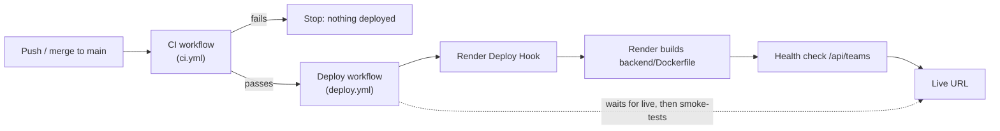

# Release Process

Every release goes through the same pipeline. Merging or pushing to `main`
is the release. Nothing reaches production unless CI passes.



## 1. Push to `main`

Work on a branch and open a pull request. CI runs on every push to every
branch and on PRs, so you see test results before merging. Merging (or
pushing directly) to `main` starts a release.

## 2. CI runs the tests

`.github/workflows/ci.yml` (workflow name **CI**) has two jobs:

| Job | What it checks |
| --- | --- |
| `test` | `ruff check .`, then the unit tests, then the integration tests against SQLite **and** a real Postgres 16 service container |
| `docker-build` | That `backend/Dockerfile` still builds |

If either job fails, the release stops here. Render isn't contacted and
the version currently running stays live. See [testing.md](./testing.md)
for what the tests cover.

## 3. If green, deploy to Render

`.github/workflows/deploy.yml` (workflow name **Deploy**) starts when CI
finishes. Its deploy job runs only if that CI run **succeeded** and came
from a **push to `main`**. It then:

1. **Checks freshness.** If `main` has moved past the commit CI tested,
   it skips the deploy. The newer commit has its own CI run and deploys
   through that, so the pipeline never ships a commit that wasn't tested.
2. **Triggers Render** by POSTing to the service's Deploy Hook.
3. **Waits for the deploy to go live** by polling the Render API, and
   fails if the build or start fails. This step needs the optional
   `RENDER_API_KEY` secret.
4. **Smoke-tests** the live URL (`GET /api/teams` and `/api/standings`),
   retrying to allow for a free-tier cold start.

Render itself also health-checks `/api/teams` before sending traffic to
the new version. If the new version fails to start, Render keeps serving
the previous one.

Render's own auto-deploy is turned **off** in `render.yaml`
(`autoDeploy: false`). With it on, Render would build every push right
away, in parallel with CI, and could ship a commit whose tests fail.

### One-time setup

In GitHub, go to **Settings → Secrets and variables → Actions**:

| Kind | Name | Where to get it | Required |
| --- | --- | --- | --- |
| Secret | `RENDER_DEPLOY_HOOK_URL` | Render → `sports-scoreboard-api` → **Settings → Deploy Hook** | Yes. Without it, the Deploy job fails and nothing deploys. |
| Secret | `RENDER_API_KEY` | Render → **Account Settings → API Keys** | Optional. Lets the job wait for "live" instead of only smoke-testing. |
| Variable | `RENDER_SERVICE_URL` | The URL at the top of the service's Render page | Optional. Defaults to `https://sports-scoreboard-api.onrender.com`. |

Treat the Deploy Hook URL like a password: anyone who has it can trigger
a deploy. If it leaks, regenerate it in Render and update the secret.

After syncing the Blueprint, go to the service's **Settings** in Render
and confirm that **Auto-Deploy** shows **No**.

## 4. The live URL

The API is served at the web service URL, by default:

```
https://sports-scoreboard-api.onrender.com
```

- `GET /api/teams`, `/api/matches`, `/api/standings`: the API
- `/docs`: interactive OpenAPI docs

The Deploy job's summary page in GitHub links to this URL (the
`production` environment). The **Environments** section of the repo home
page also shows what was deployed and when.

## Checking a release

- **GitHub → Actions:** a green **CI** run followed by a green **Deploy**
  run for the same commit means that commit is live.
- **Render → service → Events / Deploys:** each deploy with its commit
  and status.
- **Render → service → Logs:** runtime logs from uvicorn.

## Rollback

Choose based on how urgent the problem is. Rolling back only changes
**code**. The Postgres data isn't touched either way. See the note on the
database below.

### Option A: Instant rollback in Render (fastest)

Use this when production is broken right now.

1. Open Render → `sports-scoreboard-api` → **Events** (or **Deploys**).
2. Find the last deploy that worked and click **Rollback** (or
   **Redeploy**) on it.
3. Render redeploys that exact earlier build. It doesn't rebuild or run
   CI, so this takes seconds to a minute.

This doesn't change `main`, so `main` still contains the bad commit. Follow
up with Option B so the next release doesn't bring the bug back. Because
auto-deploy is off, the rollback stays in place until the next successful
CI + Deploy run.

### Option B: Revert in git (permanent fix)

This is the normal fix, and it goes through the full pipeline:

```sh
git revert <bad-commit-sha>     # creates a new commit that undoes it
git push origin main
```

CI tests the revert, and if it passes, the Deploy workflow ships it. Use a
revert rather than `git reset` + force-push: history stays intact and
there's a record of what was undone and why.

### Option C: Redeploy a known-good commit manually

Use this when you need an older version but Render's rollback list no
longer has it. Revert back to that state on `main` (Option B, reverting
each later commit) so the pipeline stays the only path to production.

### Database and rollbacks

On startup the schema is created with `CREATE TABLE IF NOT EXISTS`, which
only adds and never drops. An older version of the code therefore runs
fine against the current tables, and rolling back never loses data. If a
future change ever renames or removes columns, keep it backward-compatible
for at least one release (add the new column, deploy, then remove the old
one later) so that code rollbacks stay safe.

## Summary

| Step | Where | Gate |
| --- | --- | --- |
| Push / merge to `main` | GitHub | Pull request review |
| Lint + unit + integration tests + Docker build | `ci.yml` | Must pass |
| Trigger deploy, wait for live, smoke test | `deploy.yml` | Runs only after CI succeeds |
| Health check, switch traffic | Render | `/api/teams` must return 200 |
| Rollback | Render dashboard or `git revert` | Not applicable |
