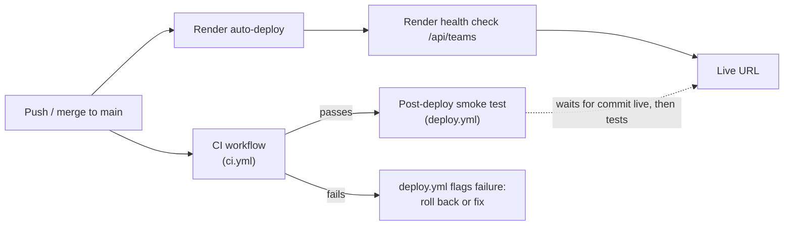

# Release Process

Pushing or merging to `main` is the release. Render deploys each push to
`main` by itself (`autoDeploy: true` in `render.yaml`). At the same time,
GitHub Actions runs CI, and after CI passes, a smoke test against the
live URL.



> **Deploys aren't gated on CI.** Render starts building as soon as the
> push lands and doesn't wait for tests. CI and the smoke test tell you
> whether a release is good *after the fact*. That's why the pull
> request step (running CI before merging) matters, and why a red run on
> `main` means [rolling back](#rollback).

## 1. Push to `main`

Work on a branch and open a pull request. CI runs on every push to every
branch and on PRs, so check that it's green **before** merging. That's
the only point where a failing test can stop a release. Merging (or
pushing directly) to `main` starts the release.

## 2. Render deploys

Render sees the push, builds `backend/Dockerfile`, and starts the new
container. Before sending traffic to it, Render health-checks
`GET /api/teams`. If the build fails or the new container never becomes
healthy, Render keeps serving the previous version, so a broken build
can't take the site down.

## 3. CI runs the tests

At the same time, `.github/workflows/ci.yml` (workflow name **CI**) runs:

| Job | What it checks |
| --- | --- |
| `test` | `ruff check .`, the unit tests, then the integration tests against SQLite **and** a real Postgres 16 service container |
| `docker-build` | That `backend/Dockerfile` still builds |

See [testing.md](./testing.md) for what the tests cover.

## 4. If green, smoke-test the live URL

`.github/workflows/deploy.yml` (workflow name **Post-deploy smoke test**)
starts when CI finishes for a push to `main`. **It doesn't deploy
anything.**

- **CI passed:** the `smoke-test` job
  1. waits until Render reports the tested commit as **live** (needs
     `RENDER_API_KEY` and `RENDER_SERVICE_ID`, see below), and fails if
     Render's build or deploy of that commit failed;
  2. calls `GET /api/teams`, `/api/matches` and `/api/standings` on the
     live URL, retrying to allow for a free-tier cold start.
- **CI failed:** the `ci-failed` job fails with a warning. Render has
  probably already deployed that commit, so either roll back or push a
  fix.

You can also run it by hand from **Actions → Post-deploy smoke test → Run
workflow** to check the live service at any time.

### Configuration

All of these are optional. Set them under **Settings → Secrets and
variables → Actions**:

| Kind | Name | Value |
| --- | --- | --- |
| Variable | `RENDER_SERVICE_URL` | Live URL. Defaults to `https://sports-scoreboard-api.onrender.com` |
| Secret | `RENDER_API_KEY` | Render → **Account Settings → API Keys** |
| Variable | `RENDER_SERVICE_ID` | `srv-...`, taken from the service's dashboard URL |

Without the API key and service ID, the job can't tell which commit is
live. It waits a minute and then smoke-tests whatever is serving, which
might still be the previous version. Set both for a real check of the new
version.

## 5. The live URL

```
https://sports-scoreboard-api.onrender.com
```

- `GET /api/teams`, `/api/matches`, `/api/standings`: the API
- `/docs`: interactive OpenAPI docs

## Checking a release

A release is good when all of these are true:

- **GitHub → Actions:** **CI** is green, and **Post-deploy smoke test**
  is green for the same commit.
- **Render → service → Events / Deploys:** the commit shows as **Live**.
- **Render → service → Logs:** no errors from uvicorn.

## Rollback

Roll back when CI goes red on `main`, when the smoke test fails, or when
you spot a bug in production. Rolling back only changes **code**. The
Postgres data isn't touched either way (see
[the database note](#database-and-rollbacks)).

### Option A: Instant rollback in Render (fastest)

1. Open Render → `sports-scoreboard-api` → **Events** (or **Deploys**).
2. Find the last deploy that worked and click **Rollback** on it.
3. Render switches back to that exact earlier build. It doesn't rebuild,
   so this takes seconds to a minute.

This doesn't change `main`, and with auto-deploy on, **the next push to
`main` deploys whatever `main` contains**. Follow up right away with
Option B so the bad commit isn't shipped again.

### Option B: Revert in git (permanent fix)

```sh
git revert <bad-commit-sha>     # creates a new commit that undoes it
git push origin main
```

Render auto-deploys the revert, and CI and the smoke test check it. Use a
revert rather than `git reset` + force-push: history stays intact and
there's a record of what was undone and why.

### Option C: Pause deploys while you investigate

If you need to stop more pushes from going out, go to Render → service →
**Settings → Auto-Deploy** and set it to **No** (or suspend the service).
Remember to turn it back on afterwards. Note that the next Blueprint sync
resets it to `autoDeploy: true` from `render.yaml`.

### Database and rollbacks

On startup the schema is created with `CREATE TABLE IF NOT EXISTS`, which
only adds and never drops. An older version of the code therefore runs
fine against the current tables, and rolling back never loses data. If a
future change ever renames or removes columns, keep it backward-compatible
for at least one release (add the new column, deploy, then remove the old
one later) so that code rollbacks stay safe.

## Summary

| Step | Where | What stops a bad release |
| --- | --- | --- |
| Pull request | GitHub | CI must be green before merging |
| Push / merge to `main` | GitHub | Nothing. This is the release. |
| Build and start | Render (auto-deploy) | Build failure or failed `/api/teams` health check keeps the old version |
| Lint + unit + integration tests + Docker build | `ci.yml` | Red means roll back |
| Wait for live, then smoke test | `deploy.yml` | Red means roll back |
| Rollback | Render dashboard or `git revert` | Not applicable |
